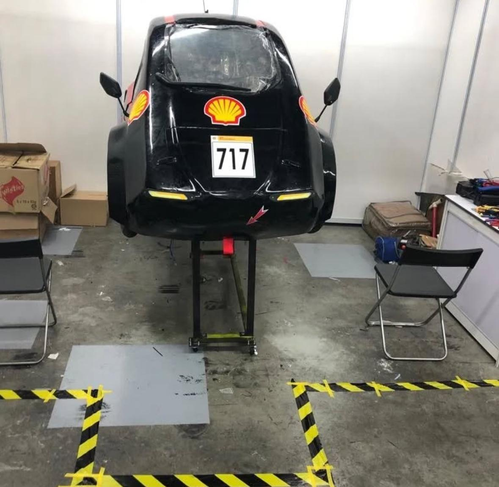

# Innovators Club Tasks

Work from my sessions with Innovators Club, where we're building an energy-efficient
electric car to race in Shell's International Eco-marathon competition. These are some of the
embedded electronics tasks we worked on that built up the skills that we're now using to develop the car's
actual dashboard and GUI pitwall.

